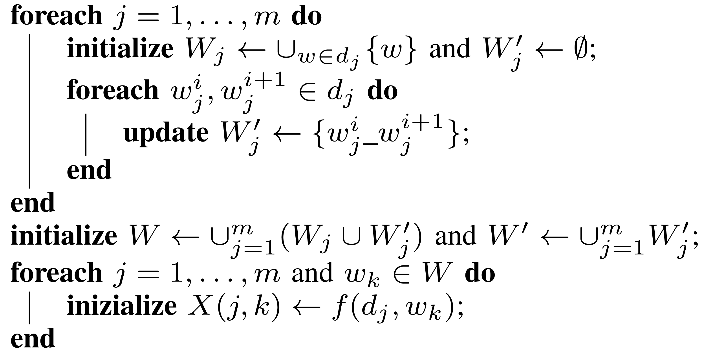
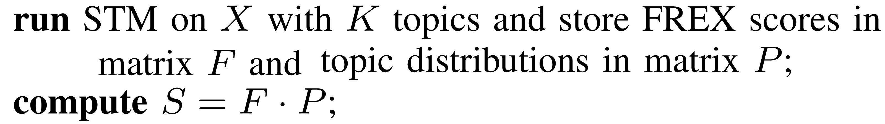
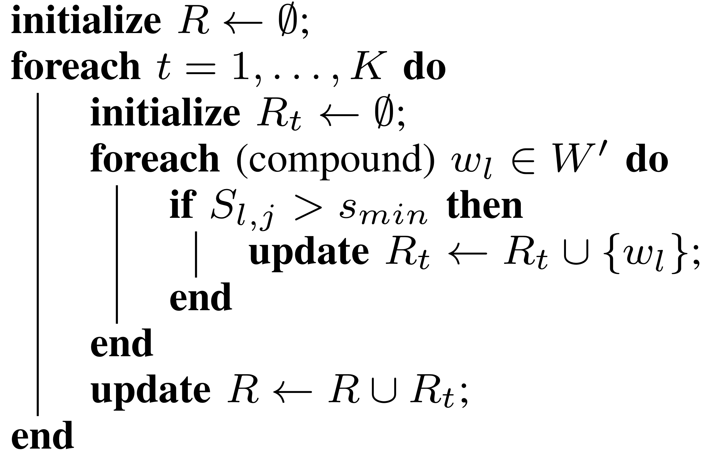
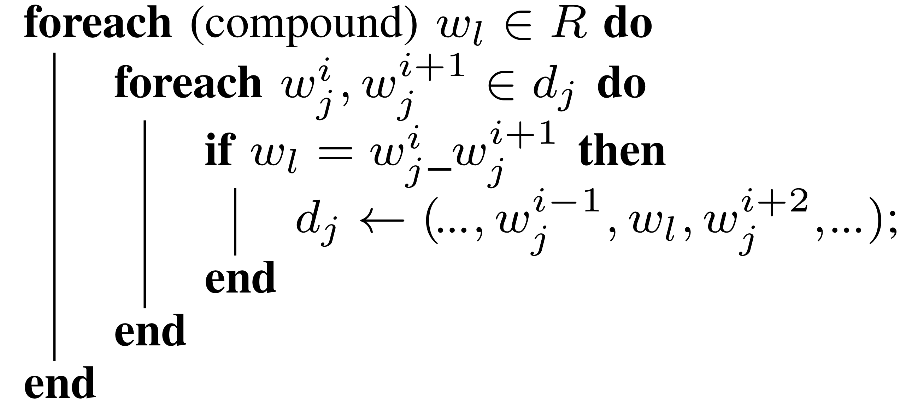
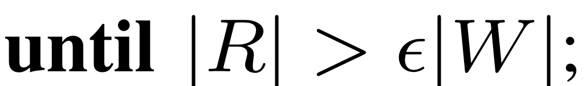
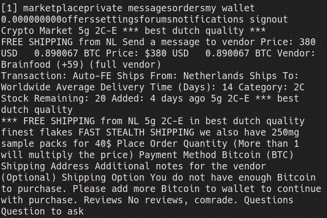
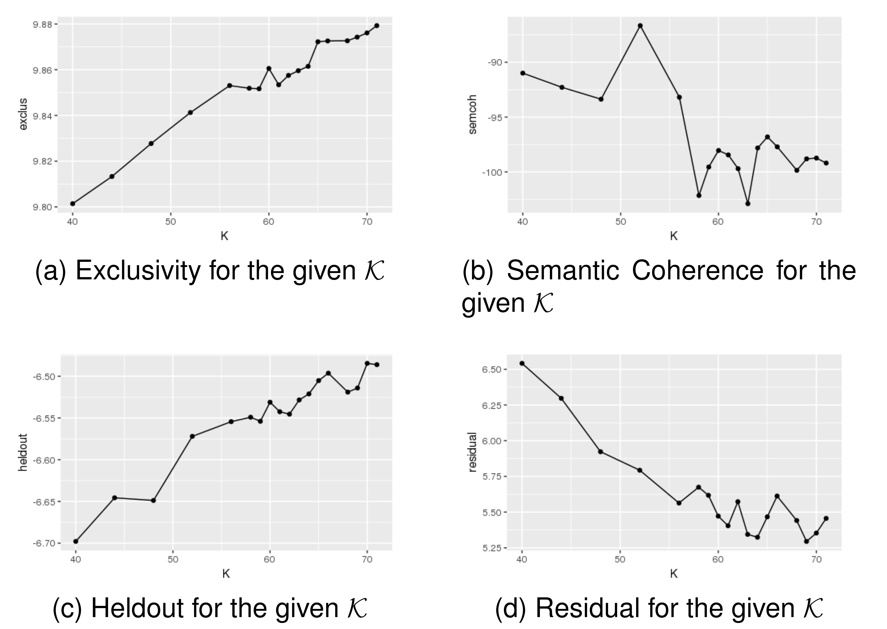
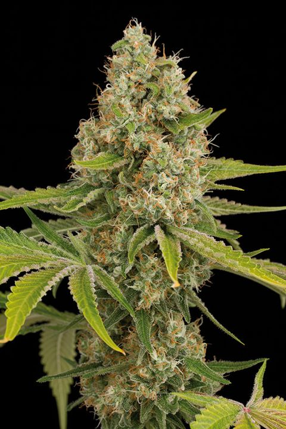

## Outline {data-background="img/mars.gif"}

-   Scope: Help Italian Investigators on ToR Drugs Marketplaces  

-   Using Topic Model:

    -   Base Structural Topic Model  
    -   Our Extension : **from Bag of Words to Bag of N-grams**  
    -   The Algorithm  \

-   Some Results  

-   Conclusions

# Scope: Help Italian Investigators on ToR Drugs Marketplaces {data-background="img/sherlock_scope.gif"}

## IANCIS ISEC Project {data-background="img/spiderman.gif"}

<small>

-   Indexing of Anonimous Networks for Crime Information Search  \

-   We performed a complete crawling of four famous ToR drug
    marketplaces: Alphabay, Crypto Market, East India and Nucleus  \

-   Marketplaces composed of pages advertising some item for sale and
    grouped by category  \

-   We generated a corpus of documents for which covariate information
    (the market and the category) are immediately available  \

-   Goals for the IANCIS project:

    1.  Understand if there is any difference between markets/categories
         \
    2.  Verify the presence of context-specific idioms and a topical
        slang  \

-   Topic Model (TM) can be a natural choice in order to analyze the
    corpus  

</small>

# NLP, NLU, NLG {data-background="img/NLP_NLU_NLG.png"  style="opacity:0" data-background-size="contain" data-background-repeat="no-repeat"}

## NLP, NLU, NLG {data-background="img/NLP_NLU_NLG.png" data-background-size="contain" data-background-repeat="no-repeat"}

<small>

> - **N**atural **L**anguage **P**rocessing\
> is  what happens when *computers read* spoken and written languages. \
**NLP** processes turn *text* into structured data. \ 
> - **N**atural  **L**anguage **U**nderstanding \
> covers the *human reading* aspects in sense of finding *meanings*.\
  Examples are: \
  *Profanity Filters* (Does this forum posts contain any profanity?)\
  *Sentiment Polarity Detection* (Is this a positive or negative reviews) \
  *Entity Detection* (What locations are referenced in this text message?) \
  *Topic Classification* (What is this corpus about?)  \
Some times *human reading* needs a mixup of different aspects, e.g. Topic Sentiment Classification  \ 
> -  **N**atural  **L**anguage **G**eneration\
> is  what happens when *computers write/spoke* languages.\
**NLG** turn structured data into text. 

</small>

# Topic Model Recap  {data-background="img/Presidents.gif"}

## What Topic Models Means for [Wikipedia](https://en.wikipedia.org/wiki/Topic_model)   {data-background="img/TopicModeling01.png" data-background-size="contain" data-background-repeat="no-repeat"}

> -  Topic model are statistical models for discovering the abstract *topics* that occur in a collection of documents.

> -  A document typically concerns multiple topics in different proportions; thus, in a document that is 10% about cats and 90% about dogs, there would probably be about 9 times more dog words than cat words.

> - A topic model captures this intuition in a mathematical framework, which allows examining a set of documents and discovering, based on the statistics of the words in each, what the topics might be and what each document's balance of topics is. 
   
    

- 

## What Topic Models Means for [David M. Blei](https://www.cs.princeton.edu/~blei/papers/Blei2012.pdf)  {data-background="img/TopicModeling01.png" data-background-size="contain" data-background-repeat="no-repeat"}

> - Topic models can organize the collection according to the discovered themes.

> - *Probabilistic* topic models are algorithms for discovering the main themes that
pervade a large and otherwise unstructured collection of documents.

> - Topic modeling algorithms can be applied to massive collections of documents. Recent advances in this field allow us to
analyze streaming collections, like you might find from a Web API.

> - Topic modeling algorithms can be adapted to many kinds of data. Among
other applications, they have been used to find patterns in genetic data, images, and social networks.

## What Topic Models Means for [Me](https://www.linkedin.com/in/mario-santoro-0006b86)  {data-background="img/TopicModeling01.png" data-background-size="contain" data-background-repeat="no-repeat"}

> - Topic Models can be seen as fuzzy cluster analysis applied to a _vocabulary matrix_
> - Using different measures/probability distributions
> - Topics can be seen as latent variables: we can observe only documents that contains topics with different probabilities not the topics themselves
> - Topics can be view as data. Can we do any statistics on Topics?

# Our Choice: Structural Topic Model (STM) {data-background="img/STM_Scheme.png" data-center="false"}

## Structural Topic Model (STM) {data-background="img/STM_Scheme.png" data-background-position="bottom" data-background-size="30%"}

<!-- > Structural Topic Modelling is a recent extension to TM  -->

> -   STM allows incorporating tags, categories, metadata and other
>     information accompanying the text archive  \
>
> -   STM uses covariate information to parametrize the prior
>     distributions to potentially affect both topical prevalence and
>     topical content.
>
>     ::: {.fragment .current-visible}
>     ::: highlight-red
>     Goal number 1
>     :::
>     :::
>
>      \
>
> -   STM use the Bag Of Word approach
>
>     ::: {.fragment .current-visible}
>     ::: highlight-red
>     ~~Goal number 2~~
>     :::
>     :::

  <!-- <aside class="notes"> --> <!-- This is my note. -->

<!-- - It can contain Markdown -->

<!-- - like this list -->

<!-- </aside>   -->

# Bag Of Words (BOW) Recap {data-background="img/BOW_2.gif"}

## Bag Of Words (BOW) Recap {data-background="img/BOW_2.gif" data-background-position="right" data-background-size="10%"}

<small>

> -   Bag Of Words (BOW) paradigm: documents are viewed as a multisets
>     of words, ignoring grammar and syntax  \
> -   Only focusing on unigrams frequencies  \
> -   Inability to detect topical multi-word expressions (phrasemes)
>      \
> -   Difficulty in visualizing/interpreting the obtained topics  \
> -   For example we can build a corpus of texts speaking a lot of:
>     United States, United Arab Emirates, United Kingdom, United
>     Nations  \
> -   Running a topic (1-gram) model can generate topic like that:
>     united, president, election, arab, nations, states, kingdom,
>     emirates  \
> -   Is united referring to? UAE? USA? UK? UN?  \
> -   Taking into account phrasemes can generate topic content like
>     that: united_arab_emirates, arab_nations, president_election,
>     kingdom

</small>

# Our Extended STM {data-background="img/Extended_STM.gif"}

## Our Extended STM {data-background="img/Extended_STM.gif" data-background-position="right bottom" data-background-size="20%"}

> -   **The rationale**: adding an idiom to the dictionary helps topics
>     extraction and characterization only as long as the idiom and its
>     components express different concepts that are relevant to
>     different topics  
> -   **In practice**: standard STM without covariates modeling is
>     iteratively used to detect topic-relevant token-pairs which are
>     merged into a **single extended_word**, up to a moment when no
>     more relevant compound terms emerge  
> -   From Bag Of Words to **Bag Of N-grams**

# The Algorithm {data-background="img/Algorithm_ICSC_00_Overall.png" data-background-position="left" data-background-size="45%"}
 
## The Algorithm (running...) {data-background="img/running.gif" data-background-position="right bottom" data-background-size="15%"}

<small>

> -   $D = \{d_1, . . . , d_m\}$ is our corpus of $m$ documents  \
> -   Step zero is preprocessing:  \
  >    *I* Removing special characters and forcing to lowercase  \
  >    *II* Tokenizing the string into words  \
  >    *III* Removing stop-words (i.e., function words, auxiliary/lexical
        verbs, adverbs/adjectives, file extensions, ...)  \
  >    *IV* Each document is formatted as an ordered list
        $d_j = (w_j^1,\ldots,w_j^{n_j})$  

</small>

## The Algorithm (running...) {data-background="img/running.gif" data-background-position="right bottom" data-background-size="15%"}

::: {.column style="float:left; width: 50%"}
<small>

> -   Given two consecutive tokens $w_1$ and $w_2$, $w_1\_w_2$ denotes
    their concatenation ($w_1$ and/or $w_2$ may be the concatenation of
    any number of words)  \
> -   The dictionary $W$ is the union of the tokens and their
    concatenation  \
    <!-- - $f(d_j,w)$ denotes the tf-idf of -->
    <!-- (compound) word $w$ in document $d_j$ -->

</small>
:::

::: {.column style="float:right; width: 40%"}
    
:::

## The Algorithm (running...) {data-background="img/running.gif" data-background-position="right bottom" data-background-size="15%"}

 <small>

> -   Let $|W|$ be the total number of tokens and $|D|$ the number of
    documents  \
> -   $F$ is the $|W| × K$ matrix whose entry $F_{l,t}$ is the FREX score
    of token $w_l$ with respect to topic $t$  \
> -   $P$ is the $K × |D|$ matrix whose entry $P_{t,j}$ is the probability
    of topic $t$ appearing in document $d_j$  \
> -   The product $S = F·P$ yields a $|W| × |D|$ matrix whose entry
    $S_{l,j}$ is a score of the relevance of word $w_l$ in document
    $d_j$

</small>

## The Algorithm (running...) {data-background="img/running.gif" data-background-position="right bottom" data-background-size="15%"}

::: {.column style="float:left; width: 50%"}
  Compound tokens selection    <small> Using empirical
considerations for our corpus  $p_{min} = 0.01$, $FREX_{min} = 0.95$
and then   $s_{min} = p_{min} \cdot FREX_{min} = 9.5 \cdot 10^{-3}$
</small>      Dictionary update
:::

::: {.column style="float:right; width: 40%"}

:::

## The Algorithm (...end) {data-background="img/running_end.gif" data-background-position="bottom" data-background-size="25%"}

Using empirical considerations, for our corpus $\epsilon |W| = 100$

# Results {data-background="img/results02.gif"}

<!-- ## Our Corpus {data-background="img/name_of_the_rose.gif"} -->

## Our Corpus {data-background="img/livraria-lello-stairs.jpg"}

+----------------+----------------+
| Market         | \# of pages    |
+:==============:+:==============:+
| Nucleus        | 8902           |
+----------------+----------------+
| Alphabay       | 7472           |
+----------------+----------------+
| Crypto Market  | 2435           |
+----------------+----------------+
| East India     | 1682           |
+----------------+----------------+
| **Total        | 20491          |
| Pages**        |                |
+----------------+----------------+

##  A Random Data Record {data-background="img/alphabay.png"} 

<small>

[1] crypto  
Levels: alphabay   crypto   eastindia   nucleus

[1] 2c  
44 Levels: 2c   analgesics   benzodiazepines   benzos ...   xanax

[1] "bbjFeREsGErcoq5XQ2ZmBj5nNUEbrqGCAZhORVex.html"

</small>

## Running Final STM with Covariates: $K$ {data-background="img/Run_Forrest.gif"}

  

<small>

-   There is not a *true* value for $K$

-   It depends on the objective of the study

-   *searchK* function in STM use 4 different tests: exclusivity,
    semantic coherence, heldout, and residual.

-   We used *searchK* on the set
    $\mathcal{K} = \{40, 44, 48, 52, 56, 58, 59, 60, 61, 62, 63, 64, 65, 66, 68, 69, 70, 71\}$

-   Choice of $\mathcal{K}$: to explore a relatively wide range of
    values most of them larger than 44 (the number of categories):

    -   to assess the ability of Topic Modelling to (automatically)
        produce a refined characterization of the dataset
    -   to extract cross-category topics such as "shipment" or "drugs
        effects"

</small>

##  {data-background="img/Run_Forrest.gif" data-background-transition="convex"}

## Running Final STM with Covariates: $K$ {data-background="img/Run_Forrest.gif" data-background-transition="convex"}

{width="60%"}

We decided to set K = 65 as it seems to provide a reasonable trade-off
among the four metrics

#  {data-background="img/Breaking_Bad_Ice_Meth.png" data-background-transition="convex"}

<!-- Background thanks to http://sbll.org/breakingbad/ -->

## Topic 30: Methamphetamine {data-background="img/Breaking_Bad_None.png" data-background-transition="convex"}

::: {.column style="float:left; width: 50%"}
-   The highest score tokens were:

    -   ice, meth, **crystal_meth**, shards
    -   **crystal_methamphetamine**
    -   **0.5g_crystal_methamphetamine**
:::

::: {.column style="float:right; width: 40%"}
{width="70%"}
:::

-   Methamphetamine was tagged only in Crypto Market with frequency of
    0.022

-   Using the *estimateEffect*:

    -   in Nucleus (0.0218) the topic is 2 times more prevalent respect
        the others (0.0114)

        ::: {.fragment .current-visible}
        (it is statistically significant!)
        :::

#  {data-background="img/Breaking_Bad_Hashish_Sativa.png" data-background-transition="convex"}

<!-- Background thanks to http://sbll.org/breakingbad/ -->

## Cannabis and Hashish Topics {data-background="img/Breaking_Bad_None.png" data-background-transition="convex"}

<small>

::: {.column style="float:left; width: 50%"}
-   $7$ different topics: $1, 14, 22, 46, 50, 54, 56$

-   Zoom to the $56$ which highest score tokens were:

    -   **shatter_pull_snap**, **sour_strawberry_diesel**
    -   **og_kush**, **ak_strain**, indoor, scout, hybrid, indica
    -   sativa, **chemicalscannabis_hashishbuds**, **content_thc_cbd**,
        **14g_black_diamond**

-   Using the *estimateEffect*:

    -   in East India the topic $56$ show a $30\%$ increase respect to
        the others

        ::: {.fragment .current-visible}
        (it is statistically significant!)
        :::

</small>
:::

::: {.column style="float:right; width: 50%"}
{width="45%"}
{width="45%"}
:::

# Conclusions and Future Works {data-background="img/2001_ending.gif"}

## Conclusions {data-background="img/inception_end.gif"}

> -   As an exploratory approach we opted for an ad-hoc heuristic based
>     on iteratively apply standard STM to detect topic-relevant
>     term-pairs and merge them into a single extended-word

> -   The coherence and the intelligibility of the obtained topics were
>     significantly enhanced

> -   Through a fine-grained and cross-market analysis of the thematic
>     organization of the corpus we were able to gain relevant
>     information about drug trade on ToR that goes well beyond those
>     provided by the already available high level content
>     classification

## Future Works {data-background="img/time_machine.gif"}

> -   Extend the *a priori* joint distributions to the N-grams and to
>     the skip-grams  
> -   Increase performances  
> -   Now all is running on CPU on R -> GPU version also using R (RCuda
>     package)

# ... this is the END {data-background="img/truman_show_end.gif"}

## THANKS!!! {data-background="img/truman_show_end.gif"}

[github.com/santoroma/2021_IAC_WELCOME](https://github.com/santoroma/2021_IAC_WELCOME)
